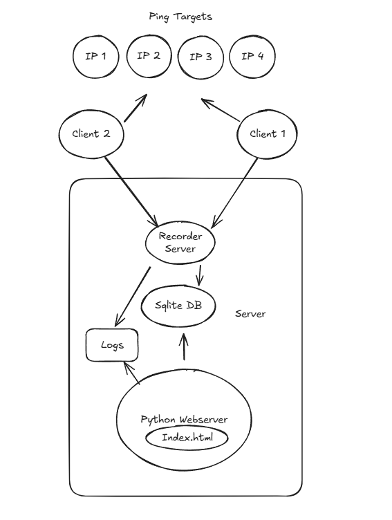

# Ping Tool

**Date:** 2025-06-02
**Author:** Sven

---

## Overview

**Ping Tool** is a Python-based system that records ping latency across multiple IPs and visualises the results in a web interface. It contains three components:

| Component      | Purpose                                                                |
| -------------- | ---------------------------------------------------------------------- |
| **Client**     | Pings target IPs and pushes latency data to the recorder.              |
| **Recorder**   | Receives latency data and writes it to a SQLite database.              |
| **Web Server** | Reads the database and displays interactive charts (Flask + Chart.js). |

All components can run standalone for testing or as `systemd` services in production.

---

## Architecture

```mermaid
┌──────────────┐
│   Client(s)  │
│ (Linux/Win)  │
└─────┬────────┘
      │ ping data
      ▼
┌──────────────┐
│  Recorder    │
└─────┬────────┘
      │ writes
      ▼
┌──────────────┐
│  SQLite DB   │
└─────┬────────┘
      │ reads
      ▼
┌──────────────┐
│   Web App    │
└──────────────┘
```



---

## Quick-start (venv-first workflow)

### 1. Clone and enter the project

```bash
git clone git@192.168.1.71:/sg_it/ping_tool
cd ping_tool
```

### 2. Create & activate a virtual environment

```bash
python3 -m venv venv          # create
source venv/bin/activate      # activate (Linux/macOS)
# .\venv\Scripts\Activate.ps1 # Windows PowerShell
```

> Your prompt now shows `(venv)`.

### 3. Install dependencies

```bash
pip install -r requirements.txt
```

### 4. Run each component for a quick test

```bash
# still inside (venv)
python ping_tool_recorder.py
python ping_tool_web.py
python ping_sender.py
```

Press `Ctrl-C` to stop each script.

---

## Deploying with `systemd` (using the venv interpreter)

Create three unit files in `/etc/systemd/system/`.
Replace `/abs/path/to/project` with the real project directory and `your_user` / `your_group` as appropriate.

<details>
<summary><strong>ping_tool_recorder.service</strong></summary>

```ini
[Unit]
Description=Ping Tool – Recorder
After=network.target

[Service]
User=your_user
Group=your_group
WorkingDirectory=/abs/path/to/project
ExecStart=/abs/path/to/project/venv/bin/python ping_tool_recorder.py
Restart=always
RestartSec=5

[Install]
WantedBy=multi-user.target
```

</details>

<details>
<summary><strong>ping_tool_web.service</strong></summary>

```ini
[Unit]
Description=Ping Tool – Web Server
After=network.target

[Service]
User=your_user
Group=your_group
WorkingDirectory=/abs/path/to/project
ExecStart=/abs/path/to/project/venv/bin/python ping_tool_web.py
Restart=always
RestartSec=5

[Install]
WantedBy=multi-user.target
```

</details>

<details>
<summary><strong>ping_tool_client.service</strong></summary>

```ini
[Unit]
Description=Ping Tool – Client
After=network.target

[Service]
User=your_user
Group=your_group
WorkingDirectory=/abs/path/to/project
ExecStart=/abs/path/to/project/venv/bin/python ping_sender.py
Restart=always
RestartSec=5

[Install]
WantedBy=multi-user.target
```

</details>

### Enable & start

```bash
sudo systemctl daemon-reload
sudo systemctl enable --now ping_tool_recorder.service
sudo systemctl enable --now ping_tool_web.service
sudo systemctl enable --now ping_tool_client.service
```

### Monitor

```bash
sudo systemctl status ping_tool_recorder.service
sudo journalctl -u ping_tool_recorder.service -f
```

---

## Configuration Hints

| Item                           | Where to change                      |
| ------------------------------ | ------------------------------------ |
| Recorder URL (`RECORDER_BASE`) | `ping_sender.py`                     |
| List of IPs to ping            | `ips_to_ping` in `ping_sender.py`    |
| Client name                    | `CLIENT_NAME` in `ping_sender.py`    |
| Port / host of web app         | `app.run(...)` in `ping_tool_web.py` |

---

## Technical Stack

| Layer           | Tech             |
| --------------- | ---------------- |
| Language        | Python 3.10+     |
| DB              | SQLite3          |
| Web             | Flask + Chart.js |
| Ping            | ping3 library    |
| OS              | Ubuntu 24.04     |
| Service manager | systemd          |

---

## Todo

* [ ] Replace `localhost:5001` with recorder’s real address in clients.
* [ ] Tune `ips_to_ping` and `CLIENT_NAME`.
* [ ] Add TLS / authentication if exposing the API publicly.
* [ ] If the "data" folder doesn't exist, need to create it by the program.
---

## Repo updates

```bash
GIT_SSH_COMMAND='ssh -i ~/.ssh/id_ed25519 -o IdentitiesOnly=yes -p 12215' \
git pull git@192.168.1.71:/sg_it/ping_tool
```

---

> **Tip:** keep the `venv` folder inside the project so the service files always reference a fixed interpreter path.
